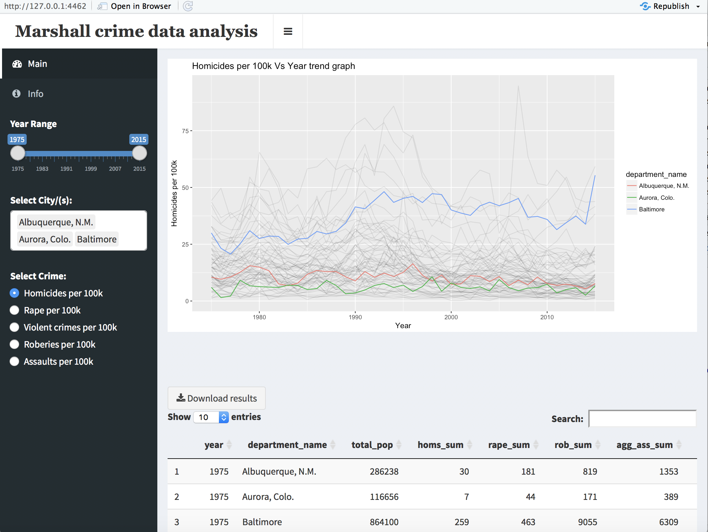
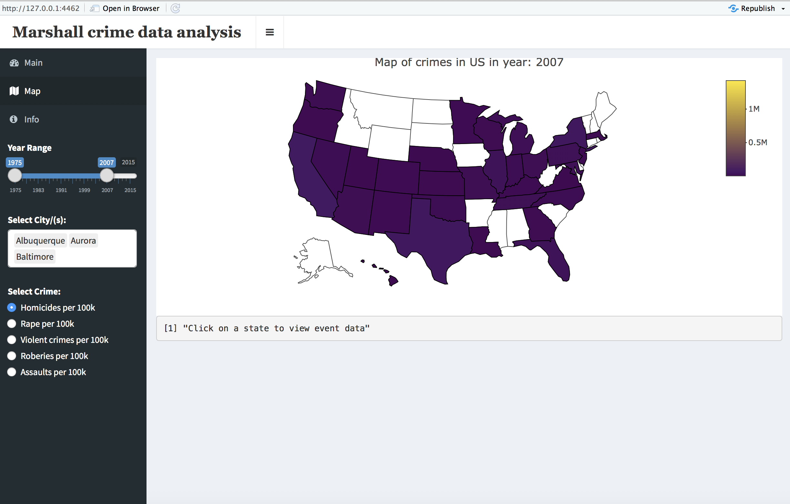
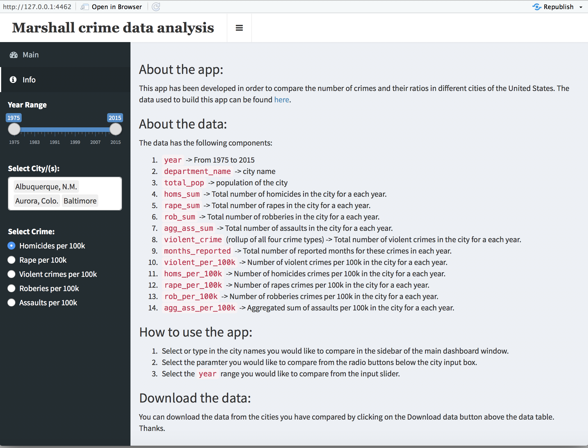

# The Marshall Project Dataset Shiny app

### About the app:

This app has been developed in order to compare the number of crimes and their ratios in different cities of the United States. The data used to build this app can be found [here](https://www.themarshallproject.org/).

### About the data:

The data has the following components:

1. `year` -> From 1975 to 2015
2. `department_name` -> city name
3. `total_pop` -> population of the city
4. `homs_sum` -> Total number of homicides in the city for a each year.
5. `rape_sum` -> Total number of rapes in the city for a each year.
6. `rob_sum` -> Total number of robberies in the city for a each year.
7. `agg_ass_sum` -> Total number of assaults in the city for a each year.
8. `violent_crime` (rollup of all four crime types) -> Total number of violent crimes in the city for a each year.
9. `months_reported` -> Total number of reported months for these crimes in each year.
10. `violent_per_100k` -> Number of violent crimes per 100k in the city for a each year.
11. `homs_per_100k` -> Number of homicides crimes per 100k in the city for a each year.
12. `rape_per_100k` ->  Number of rapes crimes per 100k in the city for a each year.
13. `rob_per_100k` -> Number of robberies crimes per 100k in the city for a each year.
14. `agg_ass_per_100k` -> Aggregated sum of assaults per 100k in the city for a each year.

### How to use the app:

1. Select or type in the city names you would like to compare in the sidebar of the main dashboard window.
2. Select the paramter you would like to compare from the radio buttons below the city input box.
3. Select the `year` range you would like to compare from the input slider.
4. The `maps` tab displays a plotly map of the United States and the number of crimes in the latest year selected in the year slider input.

### Download the data:

You can download the data from the cities you have compared by clicking on the Download data button above the data table. Thanks.

### Screenshots:

#### Main dashboard

#### Interactive map of the US showing violent crimes in different states.

#### A walkthrough of the shiny app for new users.

