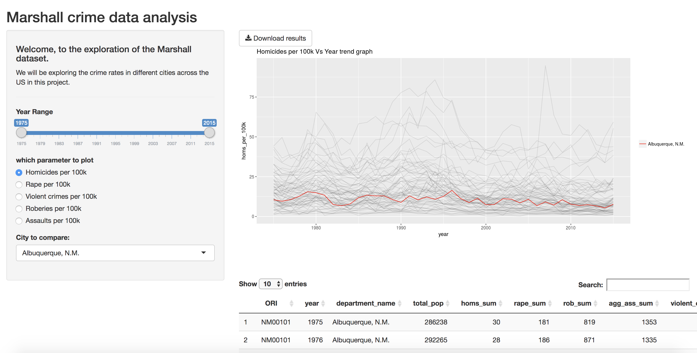
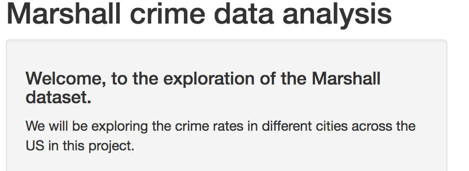
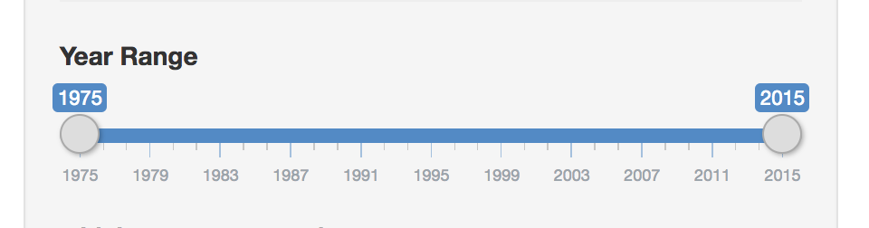
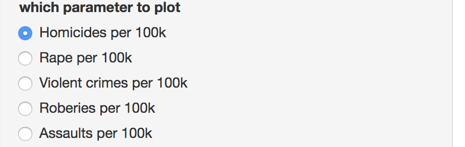
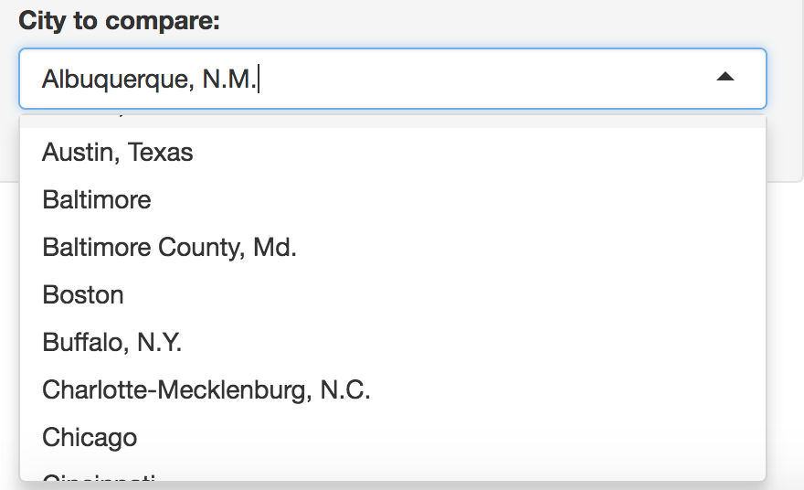
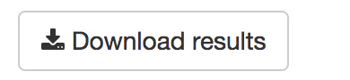

#  Design Rationale

focusing on the interaction aspects and connecting these choices to a data abstraction (including a characterization of the raw data types and their scale/cardinality, and of any derived data that you decide compute)

I have utilized the following design to effectively do the job of comparing the criminal records and trends across different cities. Shown below is the dashboard of the same.

##### The header of the function window gives the user a context into what will be analyzed.

##### The slider input takes in a range of the year and then uses that information to plot it on the graph.

##### The paramter radio button takes in a parameter value from a range of values and then uses them on the plot's y-axis. The paramters can range from homicides, rapes, violent crimes and assaults. I wanted this to be a radio button because there can be only one parameter that can be plotted on the y-axis.

##### The select input button can be used to select the city to compare with others. This will then be used to filter out the dataset to include just that city.

##### The `Download results` button can be used by the user to download the data table as a CSV onto their own computer. 

##### The graph displays the trend in crime data as compared to all the other cities in the Marshall dataset.

##### The data table can be used to view the data in a flexible manner.

# Visual Encoding

You should also concisely describe your visual encoding choices.

I wanted to see the trend in a particular city's crime rate as opposed to other cities. This could be done by highlighting the trend in red and plotting the rest of the trend lines with low opacity.

# Change in vision since proposal

I had initially set out to design an app that would display the translink data on a shiny app. But I ran into some troubles with extracting the latest bus locations so I had to stall this project for the moment, and have instead developed this app where I am analyzing the Marshalls Crime data. The first version of this app does do all the functionality I have descibed in my proposal. I aim to build on this further by adding some more graphs and analysis.